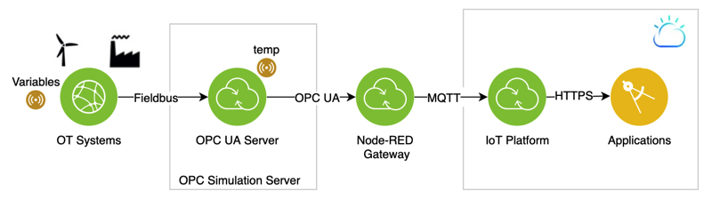

# Transfer OPC UA Data to the IBM Internet of Things platform
## Introduction
More and more manufacturing enterprises want to tighter integrate their manufacturing systems, also called operations technology (OT, think of equipment, [SCADA](https://en.wikipedia.org/wiki/SCADA) or [PLC systems](https://en.wikipedia.org/wiki/Programmable_logic_controller)), with their informations technology systems to become more productive and flexible. While modern IT systems use protocols like http, websockets, MQTT (for IoT) and architectural styles (e.g. REST), for OT systems a variety of other protocols are being used. In order to access this data a protocol conversion is needed. 

Fortunately [OPC UA](https://en.wikipedia.org/wiki/OPC_Unified_Architecture) becomes a standard protocol and OPC UA servers can be used to connect OT systems (like SCADA, PLC) which each other and with IT systems. If you want to try out the visualization of sensor data or build a worker assistant based on OPC UA you can use the tutorial as a starting point. An OPC UA Simulation Server will be used to simulate the 

## Prerequisites
To implement this scenario you need 
- an IBM Cloud account, please sign-up with the [IBM Cloud](https://cloud.ibm.com/registration) if not done already,
- a free [Prosys OPC UA Simulation Server](https://www.prosysopc.com/products/opc-ua-simulation-server/), which runs on Windows, Linux and MacOS , see also the [user manual] (https://downloads.prosysopc.com/opcua/apps/JavaServer/dist/4.0.2-108/Prosys_OPC_UA_Simulation_Server_UserManual.pdf)

It is assumed that you have some OT proficiency already.

## Steps
Below are the steps to consume the OPC UA data on the IoT platform. 

### OPC UA Simulation Server 
We are using the Prosys OPC UA Simulation server generating the simulation data
* download and install the Prosys OPC UA Simulation Server on your laptop
* run the *Prosys OPC UA Simulation Server* from the desktop and note down the ocp.tcp address, e.g. opc.tcp://your-opc-ua-address:53530/OPCUA/SimulationServer
* activate *Options > Expert Mode*
* on the Simulation tab modify the simulation data that is needed

I added a temp parameter that ranges from -2 to 2 (default). On the Address Space tab you can see the attribute values of all simulated variables; we are using the temp varibale:  *ns=3;s=temp* 

**Optional (for testing purposes)** 
* install an OPC UA client on your local machine and connect to the OPC UA server using the ocp.tcp address

### IoT Platform
The IoT platform is used as an MQTT broker, receiving and forwarding MQTT events as well as visualizing them on a dashboard. 
* create an [Internet of Things Platform service](https://cloud.ibm.com/catalog/services/internet-of-things-platform) and note down your Internet of Things Organization ID, e.g. *lt9l36*
* create an Internet of Things *device*, which represents the interface to the Node-RED application; note down the *Device Type* (e.g. *OPCUA*), *Device ID* (e.g. *OPCUA1*) and the *Authentication Token*

### OPC UA Broker
A **Node-RED** instance receives incoming OPC UA messages from the OPC simulation server and sends them to the IoT platform. 

* install Node-RED [locally](https://nodered.org/docs/getting-started/local), as a [Docker container](https://nodered.org/docs/getting-started/docker) or as part of the [Node-RED starter kit](https://cloud.ibm.com/developer/appservice/starter-kits/59c9d5bd-4d31-3611-897a-f94eea80dc9f/nodered) on the IBM Cloud
* install the *node-red-contrib-opcua* and the *node-red-contrib-ibm-watson-iot* nodes via the Hamburger icon > Manage palette
* import the [Node-RED flow](./node-red-flow) 

* configure the OPC UA client node *OPC-UA*: Endpoint = opc.tcp://your-opc-ua-server-address:53530/OPCUA/SimulationServer
* configure the Watson IoT node: Organization, Server-Name (youriotorgid.internetofthings.ibmcloud.com), Device Type, Device ID, Auth Token 

It should be mentioned that although Node-RED can be used to quickly build prototypes, in real production scenarios [IBM App Connect for Manufacturing](https://developer.ibm.com/integration/blog/2019/06/21/ibm-app-connect-for-manufacturing-2-0-is-now-available) can be used as a more robust (or more readily manageable) gateway to tackle more massive deployments.

### Test
Now we connect the Node-RED flow with the Watson IoT platform and check if we can see the temperature events there.
* go to https://youriotorgid.internetofthings.ibmcloud.com/dashboard/devices/browse
* click on your device (*OPCUA1*) and *Recent Events*
* in the Node-RED app open the *inject* node and modify the *Topic*, if needed. *Topic* is set to *ns=3;s=temp;datatype=Double*, which represents the namespace, the variable name and type
* click on *deploy" to deploy the Node-RED flow
* click on the *inject* node
* the *OPC UA* client node is pulling the current value of the variable from the OPC UA server in intervals of 60 seconds.  The payload of the *OPC-UA* node is then transfered to the IoT platform, there should be events showing up under *Recent Events*

### Visualization
The last step is to visualize the temperature values.
* go to https://youriotorgid.internetofthings.ibmcloud.com/dashboard/boards and click on *Create New Board*, give it a name and click *Next* and *Submit*

Now the board is created and a card on that board can be configured.
* select the board and click on *Add New Card* 
* click on *Line chart*, select the OPCUA1 device, click on *Next* and *Connect new data set*
* enter the data set's parameters:

| Parameter     | Value       | 
| ------------- |:-----------:| 
| Event         | event       | 
| Property      | value       | 
| Name          | Temperature | 
| Type          | Number      | 
| Min           | -2          | 
| Max           | 2           | 
 
* select the card size and click on *Next*

Now you can see the simulated temperature generated by the OPC UA server on the IoT platform.

The data can also be used by northbound applications, see [Application Development](https://www.ibm.com/support/knowledgecenter/SSQP8H/iot/platform/applications/app_dev_index.html).

