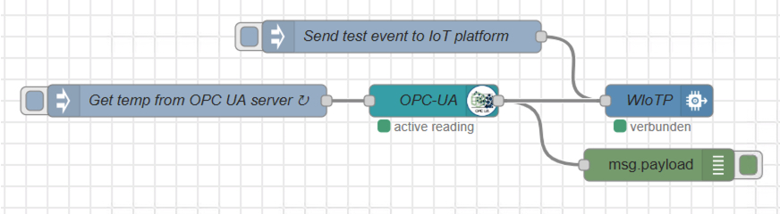

# Transfer OPC UA Data to the IBM Watson IoT platform
## Introduction
More and more manufacturers  want to tighter integrate the operations technology (OT) systems, that control the production, with their informations technology systems to become more productive and flexible.  
A typical scenario is the data transfer from these OT systems like [SCADA](https://en.wikipedia.org/wiki/SCADA) or [PLC](https://en.wikipedia.org/wiki/Programmable_logic_controller)) to an [OPC UA](https://en.wikipedia.org/wiki/OPC_Unified_Architecture) server, or in some cases to IT applications, where it can be analyzed and used for production control. The OT data is stored in OPC UA variables and contains production status, environment conditions and alike. Problem is, while modern IT systems use protocols like http, websockets, MQTT (for IoT) and architectural styles (e.g. REST), for OT systems a variety of other protocols are being used.

So in order the access OPC UA variables a protocol conversion is needed.  If you want to try out the visualization of sensor data or build a more sophisticated solution (e.g. worker assistant) based on OPC UA you can use this tutorial as a starting point. An OPC UA simulation server simulates an OPC UA server connected to a temperature sensor which is permenantly generating random temperature values.   

## Prerequisites
It is assumed that you know the manufacturing space a bit and are signed-up with the [IBM Cloud](https://cloud.ibm.com/registration). More information about the OPC simulation server can be found [here](https://downloads.prosysopc.com/opcua/apps/JavaServer/dist/4.0.2-108/Prosys_OPC_UA_Simulation_Server_UserManual.pdf). We are using [Node-RED](https://nodered.org/docs/) which is an open source tool to quickly wire-up internet of things applications, leveraging a graphical user interface. It comes with some default functionality (e.g. input nodes, output nodes), and is extensible. 

## Steps
Below are the steps to setup the OPC UA simulation Server with the IBM IoT Platform. The OPC UA simulation server and the Node-RED gateway will be running locally. 

### OPC UA Simulation Server 
First we want to generate some date. In this case we are using the free [PROSYS OPC UA Simulation Server](https://www.prosysopc.com/products/opc-ua-simulation-server/), that runs on Windows, Linux and MacOS
* download and install the PROSYS OPC UA Simulation Server
* run the *PROSYS OPC UA Simulation Server*  
* note down the ocp.tcp address, e.g. opc.tcp://your-opc-ua-address:53530/OPCUA/SimulationServer

* activate the *expert mode* by clicking on *Options > Expert Mode*
* on the *Simulation* tab modify the simulation data that is needed.

I added an OPC UA object *MIB* and a variable *temp* that ranges from -2 to 2 (just because that is the default). On the *Address Space* tab you can see the attribute values of all simulated variables. We later need them as paramaters in the Node-RED gateway, example: *ns=3;s=temp* 

### Watson IoT Platform
The purpose of Watson IoT platform is twofold:
1. it acts as an MQTT broker, receiving and forwarding MQTT events , and
2. it visualizes the events on a dashboard. 

We create an IoT service and a device in that service that represents Node-RED gateway sending events to the IoT service:
* go to the [IBM Cloud catalog](https://cloud.ibm.com/catalog)
* create a free (Lite plan) [Internet of Things Platform service](https://cloud.ibm.com/catalog/services/internet-of-things-platform)
* note down your Internet of Things Organization ID, e.g. *lt9l36*
* create an Internet of Things *device*, see the [Getting Started](https://cloud.ibm.com/docs/services/IoT?topic=iot-platform-getting-started) guide

Use descriptive names for the *Device Type* (e.g. *OPCUA*) and the *Device ID* (e.g. *OPCUA1*) and note them down. The *Authentication Token* can be generated automatically.

Now the IoT service is running and the device created, waiting for events to arrive. But before we create our visualization (temperature graph) we want to connect the OPC UA simulation server with the IoT service. 

### Node-RED Gateway
We use a simple Node-RED flow receiving messages from the OPC simulation server and sending them straight away to the IoT service. 

* install Node-RED [locally](https://nodered.org/docs/getting-started/local) or as a [Docker container](https://nodered.org/docs/getting-started/docker) 
 In our case we need two Node-RED nodes that are not pre-installed, so we need to add them to the [Node-RED palette](https://nodered.org/docs/user-guide/editor/palette/) manually before we can use them; that's a simple task, here is a [video](https://www.youtube.com/watch?v=Wlwe5Xry5cA) how that works
* just install the *node-red-contrib-opcua* and the *node-red-contrib-ibm-watson-iot* nodes via the Hamburger icon > Manage palette
Now that the nodes are installed you can
* import the [Node-RED flow](./node-red-flow) , again using the Hamburger icon 

We need to configure our input and the output nodes:
* The OPC UA client node *OPC-UA* connects to the OPC UA simulation server: Enter the endpoint = opc.tcp://your-opc-ua-server-address:53530/OPCUA/SimulationServer
* The Watson IoT node connects to our devise: Enter Organization, Server-Name (youriotorgid.internetofthings.ibmcloud.com), Device Type, Device ID, Auth Token; 

* in the Node-RED app open the *inject* node and modify the *Topic*, if needed. *Topic* is set to *ns=3;s=temp;datatype=Double*, which represents the namespace, the variable name and type

* click on *deploy" to deploy the Node-RED flow
* click on the *inject* node
* the *OPC UA* client node is pulling the current value of the variable from the OPC UA server in intervals of 60 seconds.  The payload of the *OPC-UA* node is then transfered to the IoT platform, there should be events showing up under *Recent Events*

When finished, click on *Deploy*.  Now the Node-RED flow is running and the OPC UA messages should appear in the [debug sidebar](https://nodered.org/docs/user-guide/editor/sidebar/debug).

### Test
Let's go to the Watson IoT platform and check if we can see the temperature events there:
* go to https://youriotorgid.internetofthings.ibmcloud.com/dashboard/devices/browse
* click on your device (*OPCUA1*) and *Recent Events*

### Visualization
The last step is to visualize the temperature values.
* go to https://youriotorgid.internetofthings.ibmcloud.com/dashboard/boards and click on *Create New Board*, give it a name and click *Next* and *Submit*

Now the board is created and a card on that board can be configured.
* select the board and click on *Add New Card* 
* click on *Line chart*, select the OPCUA1 device, click on *Next* and *Connect new data set*
* enter the data set's parameters:

| Parameter     | Value       | 
| ------------- |:-----------:| 
| Event         | event       | 
| Property      | value       | 
| Name          | Temperature | 
| Type          | Number      | 
| Min           | -2          | 
| Max           | 2           | 
 
* select the card size and click on *Next*

Now you can see the simulated temperature generated by the OPC UA server on the IoT platform.

The data can also be used by northbound applications, see [Application Development](https://www.ibm.com/support/knowledgecenter/SSQP8H/iot/platform/applications/app_dev_index.html).

It should be mentioned that although Node-RED can be used to quickly build prototypes, in real production scenarios [IBM App Connect for Manufacturing](https://developer.ibm.com/integration/blog/2019/06/21/ibm-app-connect-for-manufacturing-2-0-is-now-available) can be used as a more robust (or more readily manageable) gateway to tackle more massive deployments.
